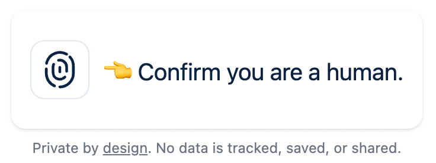

# NoCAPTCHA

Replace CAPTCHA with single-use, disposable passkeys. Human-friendly bot prevention without the frustration.

To get a feel for the widget, checkout the [hosted demo](https://demo.singlr.ai/nocaptcha/)



## Programming languages and frameworks
The API is build in Java using Helidon 4.x. Powered by Java virtual threads. The UI is pure Javascript using Vite build tool.

## Build and run
Start the server With JDK21+
```bash
mvn package
cd api
java -jar target/api.jar
```

### Debugging

For adding a debugger
```bash
java -agentlib:jdwp=transport=dt_socket,address=127.0.0.1:5005,suspend=n,server=y -jar target/api.jar
```

## Coding & naming conventions
We use the check style plugin and have adopted Google's check style [rules](https://github.com/checkstyle/checkstyle/blob/master/src/main/resources/google_checks.xml)

Configure your IDE accordingly. To ensure that you have followed the conventions, run:
```bash
mvn validate
```

## Contributing

Contributions are welcome! Feel free to help enhance either the:
- Backend passkeys-based NoCaptcha implementation
- Frontend NoCaptcha widget
- Address the TODOs in the code

Just fork the repository and submit a pull request with your improvements.